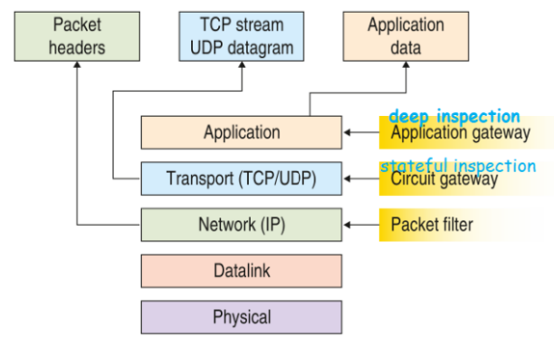

# Firewall, Proxy e DMZ
## Il Personal Firewall
Il Firewall è un servizio progettato per fornire sicurezza ad una rete. 
E' un programma installato sul proprio PC che lo protegge da attacchi esterni, solitamente di default il traffico in uscita è consentito mentre quello in entrata resterà un mistero.

## Il Network Firewall (perimetrale)
Ha almeno due interfacce di rete sulle quali il processo effettua il controllo, anche in questo caso una delle due interfacce è posizionata sulla propria rete privata e l’altra sulla rete pubblica.

## Firewall: Livelli di controllo
In base al tipo di controllo che si effettua si possono distinguere i processi di firewalling in alcune grandi categorie:
- **packet filter**: controlla il traffico a livello IP e ispeziona il flag SYN del TCP per intercettare tentativi di connessione.
- **stateful inspection**: è in grado di valutare la qualità delle connessioni TCP tramite il controllo approfondito dell’header dei pacchetti, analizzando fino a livello 4. Consente di intercettare e riconoscere il traffico TCP che apparentemente appartiene a una connessione ma in realtà costituisce un tentativo di intrusione.
- **deep inspection**: è in grado di analizzare il traffico dei pacchetti fino a livello 7, oesservando il corretto uso dei protocolli applicativi e ispezionando il contenuto. In base a un glossario su database, questo tipo di processo riesce a intercettare le firme dei virus o degli applicativi d’intrusione più diffusi. Inoltre è in grado di bloccare il traffico per determinati siti o in base a un elenco di parole chiave.

## Deep Inspection: application PROXY
Il proxy è un programma che viene eseguito sul gateway e funge da intermediario a livello di applicazione. Nelle applicazioni client- server un *proxy* comunica con il client simulando di essere il server, oppure, comunica con il server simulando di essere il client.

## Modelli di InternetWorking
!! In questa parte non si capisceun cazzo, guardiamo le slide e cerchiamo di decifrarle insieme.

  
by ***Leonardo Canu*** *5B-IA*
